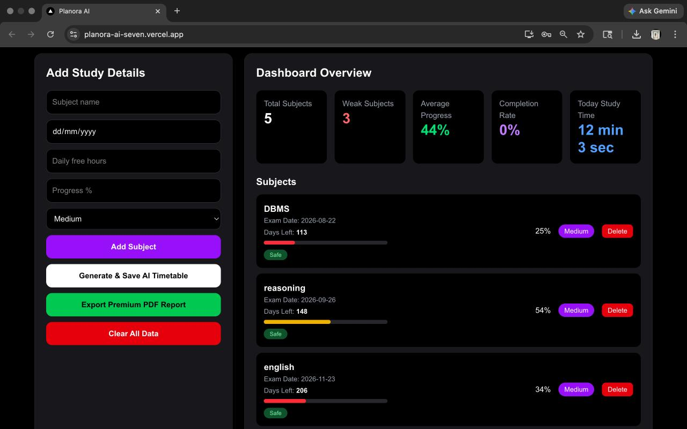
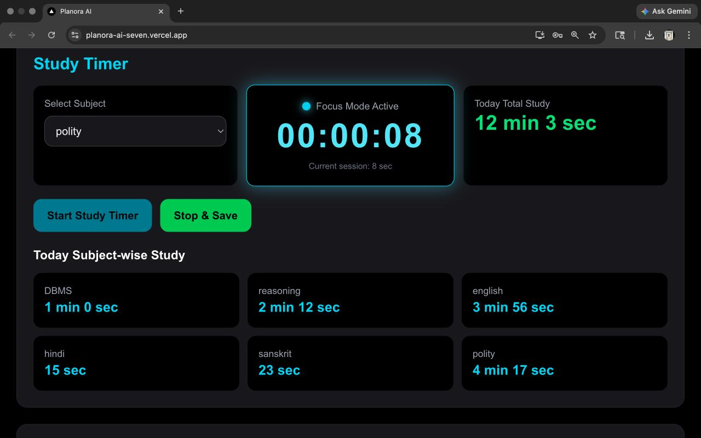
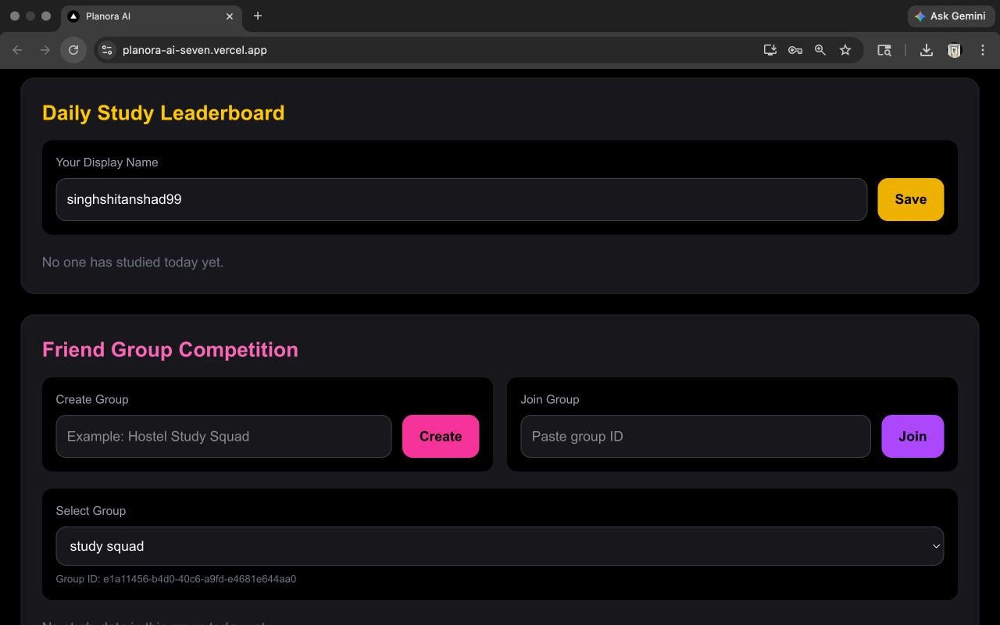
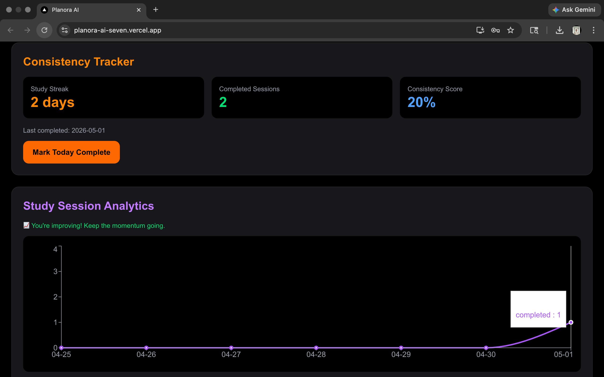

# 🚀 Planora AI — Real-Time AI Study Planner

Planora AI is a full-stack AI-powered study planner designed to help students stay consistent, track progress, and compete with friends using real-time updates.

🌐 Live Demo: https://planora-ai-seven.vercel.app

---

## 🔥 Key Features

- 🔐 User Authentication (Supabase Auth)
- 📚 Subject Management (exam date, priority, progress)
- 🤖 AI Timetable Generation
- 🧠 Daily AI Action Plan
- ⏱ Study Timer with Focus Mode
- 📊 Subject-wise Study Tracking
- 🏆 Daily Leaderboard
- 👥 Friend Group Competition
- ⚡ Real-time Study Status (live updates)
- 🔥 Study Streak & Consistency Tracking
- 📈 Analytics Dashboard (charts)
- 📄 PDF Report Export

---

## 🧠 Tech Stack

- Frontend: Next.js, React, Tailwind CSS
- Backend: Next.js API Routes
- Database: Supabase PostgreSQL
- Authentication: Supabase Auth
- Realtime: Supabase Realtime
- Charts: Recharts
- PDF: jsPDF
- Deployment: Vercel

---

## ⚡ Real-Time Capability

Planora AI uses Supabase Realtime to:

- Show live "Studying Now" status
- Update leaderboards instantly (no refresh)
- Sync group competition in real-time

---

## 🎯 Problem Solved

Most students create study plans but fail to follow them.

Planora AI solves this by combining:
- AI planning
- Real-time tracking
- Competitive motivation
- Progress analytics

---

## 🧪 How to Run Locally

```bash
git clone https://github.com/yagami-22/Planora-AI.git
cd Planora-AI
npm install
npm run dev
## 📸 Screenshots

### Dashboard


### Study Timer


### Leaderboard


### AI Insights


### Tracker Analysis

